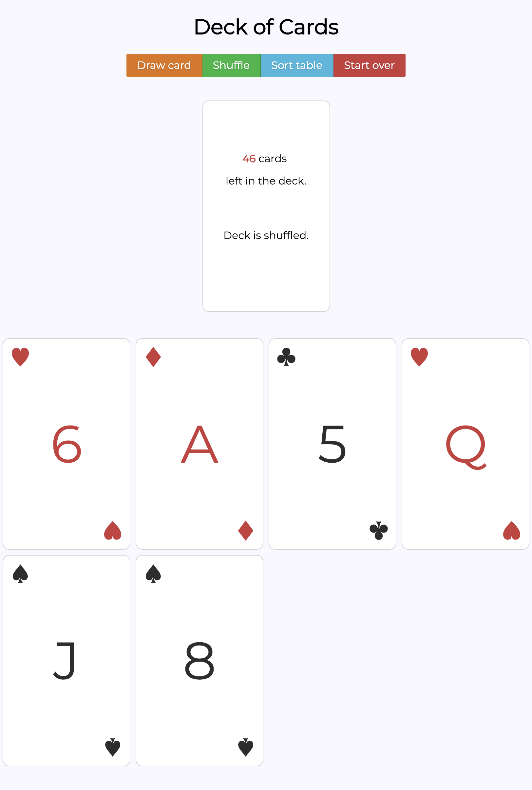
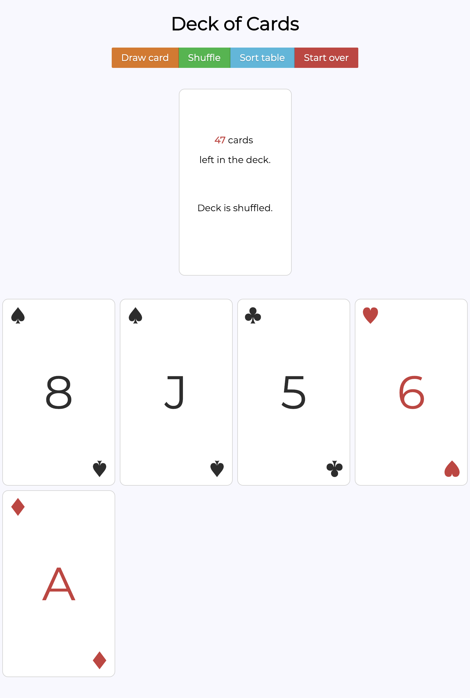

# Simple React Deck of Cards application
[](https://travis-ci.org/szymon33/cards)

## Introduction

Technology stack:

* React
* Jest
* Babel
* Webpack
* ESLint
* pure.css (not Bootstrap this time)


## Description

### User story

**As a** magician, \
**I'd like to** shuffle, draw and sort cards \
**so that I** can perform magic tricks


### Implemented functionality

1. Shuffle the deck of cards. It is ordered at the first place.
2. Pickup a card and draw the card.
3. Draw any number of cards from the deck until deck is empty.
4. Sorted cards are sorted by suit: Clubs, Spades, Hearts, Diamonds; then by value: Ace is high. Note that on the deck is like a stack so the first to take is the ace of diamonds.
5. Put any card back at the top of the deck.


## Installation

* Clone the repo
* `cd cards`
* Run `npm install`
* Run `npm start`

At this point you should see the app on

```
http://localhost:3000
```

**Note:** in order to create an optimized production build you have to run `npm build`


## Automatic tests

```
npm test
```

**Note** There is UI in terminal there


## Continuous Integration

I choose Travis. See the badge at the top of this file.


## Screenshots and how it works.

### 1. Start the app


### 2. Shuffle and take 6 cards



**Note** that 45 has cards left int the deck,

### 3. Put 8th of clubs aback and sort user table.


